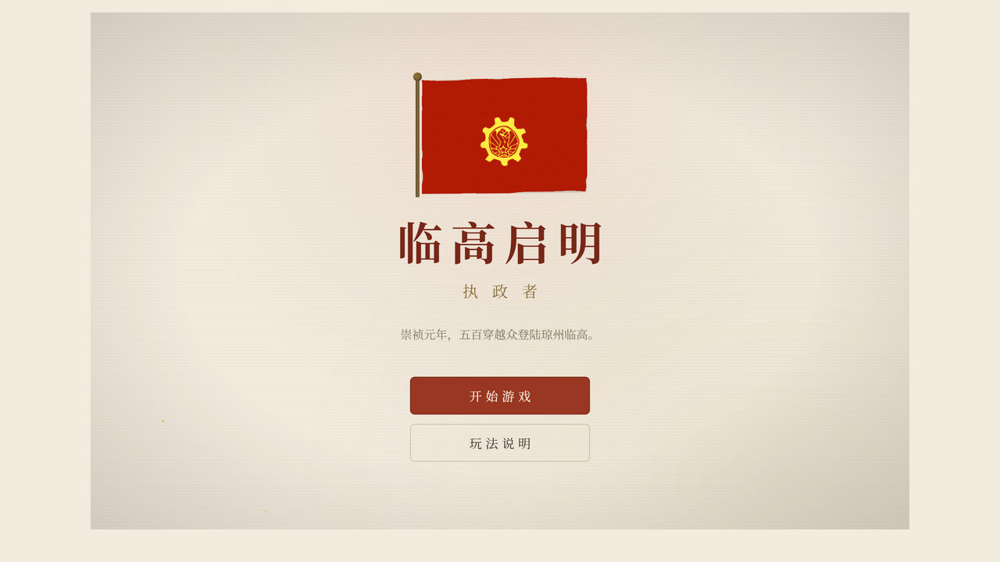
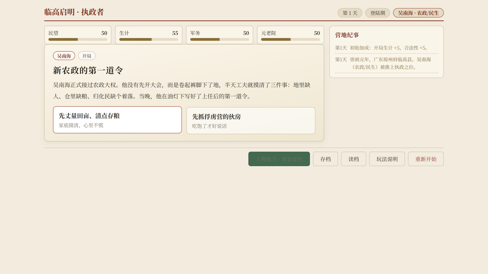

# 临高启明 · 执政者

**Lingqi: The Ruler** —— 一款以《临高启明》为背景的批牍体卡牌执政游戏（非官方同人）。

崇祯元年，五百穿越众登陆琼州临高。你从五位首长中挑一位执掌大局：
每一张卡是各口递上来的呈文，你要做的事只有一件——**批复**。
批得稳，百业兴旺；批得偏，就会被罢免、刺杀、架空或问责，
然后由下一任首长接手你留下的一切。



## 开始游玩

本机无需 Node.js，只需要 Python（3.10+）：

```bash
cd game
python serve.py 8080
```

浏览器访问 <http://localhost:8080>。

> 直接双击 `game/index.html` 无法运行：浏览器会拦截 `file://` 下的 JSON 内容包请求。



## 玩法要点

- **呈文与批复**：卡面是各口递上来的呈文短笺，左右两个「批」印选项就是你的批复。选择会改变公开的**四柱**（民望、生计、军务、元老院），也会悄悄改变**风声**、隐藏势力数值和你自身的处境（个人压力、派系警惕、暴力风险、继任合法性——全部隐藏）。
- **总崩局**：四柱任何一项滑向极端即告终局——生产崩溃、民变、军务失控、元老院分裂、外部围剿、执政失效。
- **倒台与继任**：压力逼近危险先出现前兆卡，处理失败就是倒台卡。倒台不是终点：软禁、遇刺、无人听令各有专属结局，继任者按人物数据声明的权重被推上台，前任的遗产卡与善后卡进入卡池。
- **来源即情报**：卡牌来源（吴南海、保卫组、值班秘书……）是判断谁在得势的关键线索。
- **人物能力**：每隔若干天可用一次，能救急，也会强化对应路线的风险。
- **存档**：浏览器本地存储，支持存档/读档。

## 内容规模

52 条状态定义、7 个隐藏势力、8 条事件系列、5 名首发人物
（吴南海 / 邬德 / 北炜 / 马千瞩 / 文德嗣）、142 张卡牌，
含链式事件弧、阶段报告、人物专属卡与结局卡。

## 参与贡献

内容贡献不需要会写代码——所有玩法内容都是 JSON。
见 [CONTRIBUTING.md](CONTRIBUTING.md)；动手前请先读 `docs/` 里的设计文档。

## 目录结构

```text
docs/                     设计文档（权威规格）与图片
game/
  index.html              游戏页面
  serve.py                本地开发服务器（no-cache）
  assets/                 美术资产
  content/official/       JSON 内容包（states/forces/series/characters/cards）
  src/engine/             纯逻辑引擎
  src/app/                流程控制与界面
tools/validate_content.py 内容包校验脚本
```

## 许可与声明

- **非官方同人声明**：本项目为爱好者基于《临高启明》（吹牛者等著，起点中文网连载）
  的同人再创作，与原作者及起点无关。原著一切权利归原权利人所有。
- **代码**：[MIT License](LICENSE)
- **文案与美术**：[CC BY-NC-SA 4.0](LICENSE-CONTENT)（禁止商用）
- 第三方素材出处见 `game/assets/CREDITS.md`
