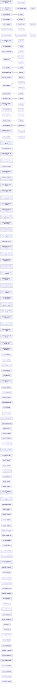

# 事件链关系图

```mermaid
flowchart LR
    CHAR-WD-EXCL-001["CHAR-WD-EXCL-001 训练班的夜课"] --> CHAR-WD-021
    CIV-001["CIV-001 栅栏里关了三十七个俘虏"] --> CIV-004
    CIV-003["CIV-003 俘虏营炸营了"] --> CIV-011
    CIV-004["CIV-004 俘虏里也有手艺人"] --> CIV-009
    CIV-007["CIV-007 归化民要立市"] --> TRADE-001
    CORE-004["CORE-004 程序问题"] --> CORE-012
    CORE-007["CORE-007 常任委员改选"] --> CORE-014
    CORE-012["CORE-012 立法之争"] --> CORE-013
    EXT-001["EXT-001 海滩外的炊烟"] --> EXT-002
    EXT-002["EXT-002 村里来了个老人"] --> EXT-004
    EXT-003["EXT-003 标桩插进了人家的田"] --> EXT-018
    EXT-005["EXT-005 族老们的章程"] --> EXT-016
    EXT-008["EXT-008 马袅盐场的差事"] --> EXT-017
    EXT-009["EXT-009 台风"] --> EXT-013
    EXT-009["EXT-009 台风"] --> EXT-014
    EXT-010["EXT-010 打摆子"] --> EXT-015
    FARM-001["FARM-001 南海农庄章程"] --> FARM-004
    FARM-009["FARM-009 二十天没下雨了"] --> FARM-014
    FARM-011["FARM-011 糖寮开榨"] --> TRADE-007
    FARM-011["FARM-011 糖寮开榨"] --> FARM-013
    LAB-001["LAB-001 工分条例"] --> LAB-003
    LAB-005["LAB-005 设里正、组长"] --> LAB-009
    PLAN-003["PLAN-003 《第一阶段建设纲要》"] --> PLAN-010
    SEC-001["SEC-001 成立保卫组"] --> SEC-010
    SEC-004["SEC-004 戒严令"] --> SEC-015
    SEC-011["SEC-011 官军来了"] --> SEC-014
    SEC-013["SEC-013 伏波军初阵"] --> CHAR-BW-021
    TRADE-003["TRADE-003 盐价三天翻了三倍"] --> TRADE-010
    TRADE-008["TRADE-008 髡货"] --> TRADE-011
    CHAR-BW-BACK-001["CHAR-BW-BACK-001 保卫组的胃口"]
    CHAR-BW-EXCL-001["CHAR-BW-EXCL-001 沙盘"]
    CHAR-BW-FALL-001["CHAR-BW-FALL-001 夜路上的黑影"]
    CHAR-BW-FALL2-001["CHAR-BW-FALL2-001 兵营的沉默"]
    CHAR-BW-LEG-001["CHAR-BW-LEG-001 黑名单"]
    CHAR-BW-OPEN-001["CHAR-BW-OPEN-001 警戒条例"]
    CHAR-BW-SUCC-001["CHAR-BW-SUCC-001 风雨飘摇，需要一个镇得住的人"]
    CHAR-MQZ-BACK-001["CHAR-MQZ-BACK-001 指标的影子"]
    CHAR-MQZ-EXCL-001["CHAR-MQZ-EXCL-001 督工查夜"]
    CHAR-MQZ-FALL-001["CHAR-MQZ-FALL-001 计划失败听证会"]
    CHAR-MQZ-FALL2-001["CHAR-MQZ-FALL2-001 被架空的督工"]
    CHAR-MQZ-LEG-001["CHAR-MQZ-LEG-001 计委的表还在跑"]
    CHAR-MQZ-OPEN-001["CHAR-MQZ-OPEN-001 计划狂的物资总表"]
    CHAR-MQZ-SUCC-001["CHAR-MQZ-SUCC-001 计委推举了新掌柜"]
    CHAR-WD-BACK-001["CHAR-WD-BACK-001 册子比军令好使"]
    CHAR-WD-FALL-001["CHAR-WD-FALL-001 罢免动议"]
    CHAR-WD-FALL2-001["CHAR-WD-FALL2-001 清洗"]
    CHAR-WD-LEG-001["CHAR-WD-LEG-001 归化民还在等他"]
    CHAR-WD-OPEN-001["CHAR-WD-OPEN-001 登记册的第一页"]
    CHAR-WD-SUCC-001["CHAR-WD-SUCC-001 民政系统迎来了自己人"]
    CHAR-WDS-BACK-001["CHAR-WDS-BACK-001 背锅侠的账本"]
    CHAR-WDS-EXCL-001["CHAR-WDS-EXCL-001 文总的茶话会"]
    CHAR-WDS-FALL-001["CHAR-WDS-FALL-001 扩大会议夺权"]
    CHAR-WDS-FALL2-001["CHAR-WDS-FALL2-001 傀儡"]
    CHAR-WDS-LEG-001["CHAR-WDS-LEG-001 文总的人情还在"]
    CHAR-WDS-OPEN-001["CHAR-WDS-OPEN-001 老好人的第一次主持"]
    CHAR-WDS-SUCC-001["CHAR-WDS-SUCC-001 元老们需要一个挡箭牌"]
    CHAR-WNH-BACK-001["CHAR-WNH-BACK-001 农口、农口"]
    CHAR-WNH-EXCL-001["CHAR-WNH-EXCL-001 试验田边的傍晚"]
    CHAR-WNH-FALL-001["CHAR-WNH-FALL-001 听证会"]
    CHAR-WNH-FALL2-001["CHAR-WNH-FALL2-001 二次逼宫"]
    CHAR-WNH-LEG-001["CHAR-WNH-LEG-001 农政系的旧部"]
    CHAR-WNH-OPEN-001["CHAR-WNH-OPEN-001 农委会的第一道令"]
    CHAR-WNH-SUCC-001["CHAR-WNH-SUCC-001 农政派被推到台前"]
    CIV-002["CIV-002 俘虏营的口粮"]
    CIV-005["CIV-005 放还是留"]
    CIV-006["CIV-006 一夜跑了十一个"]
    CIV-008["CIV-008 俘虏营的旧账"]
    CIV-012["CIV-012 基层的献礼"]
    CORE-001["CORE-001 全体大会：下一步怎么办"]
    CORE-002["CORE-002 执委会例会"]
    CORE-003["CORE-003 住房分配"]
    CORE-005["CORE-005 案头的文件"]
    CORE-006["CORE-006 大会要立章程"]
    CORE-008["CORE-008 罢免案"]
    CORE-009["CORE-009 夜谈"]
    CORE-010["CORE-010 交接箱里的旧账"]
    CORE-011["CORE-011 重新授权动议"]
    CORE-015["CORE-015 一封家书"]
    CORE-016["CORE-016 大会的背书"]
    CORE-017["CORE-017 廊下的私语"]
    CORE-018["CORE-018 前任的信"]
    EXT-006["EXT-006 两个操外地口音的人"]
    EXT-007["EXT-007 村里送来一张礼单"]
    EXT-011["EXT-011 黎峒来人"]
    EXT-012["EXT-012 疍家的船"]
    EXT-019["EXT-019 圩日的赌摊"]
    EXT-020["EXT-020 黎峒的委屈"]
    EXT-021["EXT-021 黎山马帮"]
    FARM-002["FARM-002 农忙缺人手"]
    FARM-003["FARM-003 头一茬稻子进仓了"]
    FARM-005["FARM-005 农庄要个「章程」"]
    FARM-006["FARM-006 农庄的护田队"]
    FARM-007["FARM-007 质询农庄"]
    FARM-008["FARM-008 归化民新村"]
    FARM-010["FARM-010 农庄的烂账"]
    FARM-012["FARM-012 农庄的孝敬"]
    LAB-002["LAB-002 工分吵到了案头"]
    LAB-004["LAB-004 采石场塌了半边"]
    LAB-006["LAB-006 基层组织要权"]
    LAB-007["LAB-007 只认登记册"]
    LAB-008["LAB-008 登记册比军令好使"]
    PLAN-001["PLAN-001 马千瞩的三张表"]
    PLAN-002["PLAN-002 排期表发到各口之后"]
    PLAN-004["PLAN-004 红了一片的月报"]
    PLAN-005["PLAN-005 统购统销"]
    PLAN-006["PLAN-006 计划债务"]
    PLAN-007["PLAN-007 大会质询排期"]
    PLAN-008["PLAN-008 锄头还是枪头"]
    PLAN-009["PLAN-009 计委的季度报捷"]
    SEC-002["SEC-002 夜巡的排班"]
    SEC-003["SEC-003 夜袭"]
    SEC-005["SEC-005 保卫组要扩权"]
    SEC-006["SEC-006 高压的代价"]
    SEC-007["SEC-007 一份名单在流传"]
    SEC-008["SEC-008 锥子"]
    SEC-009["SEC-009 查寝"]
    SEC-012["SEC-012 保卫组的问安"]
    SEC-016["SEC-016 军械清点"]
    SEC-017["SEC-017 军功封赏之争"]
    TRADE-002["TRADE-002 东门市的早晨"]
    TRADE-004["TRADE-004 废图纸换银子"]
    TRADE-005["TRADE-005 商会的「报效」"]
    TRADE-006["TRADE-006 广货船到了"]
    TRADE-009["TRADE-009 商团的孝敬"]
    TRADE-013["TRADE-013 行情与脚力"]
    TRADE-014["TRADE-014 广商的口信"]
```
